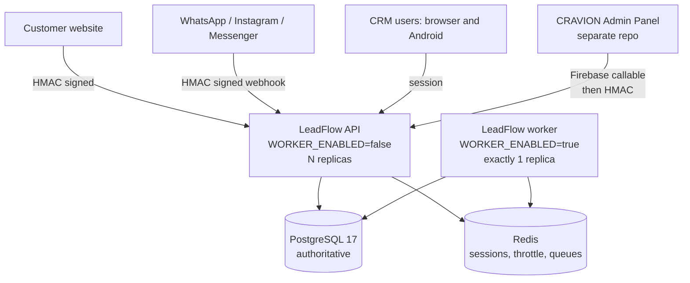
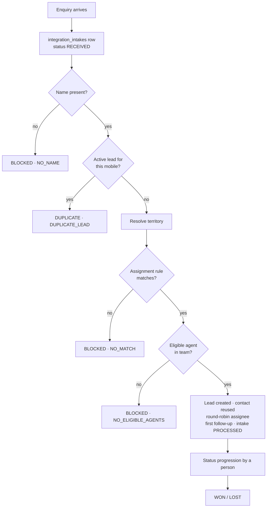
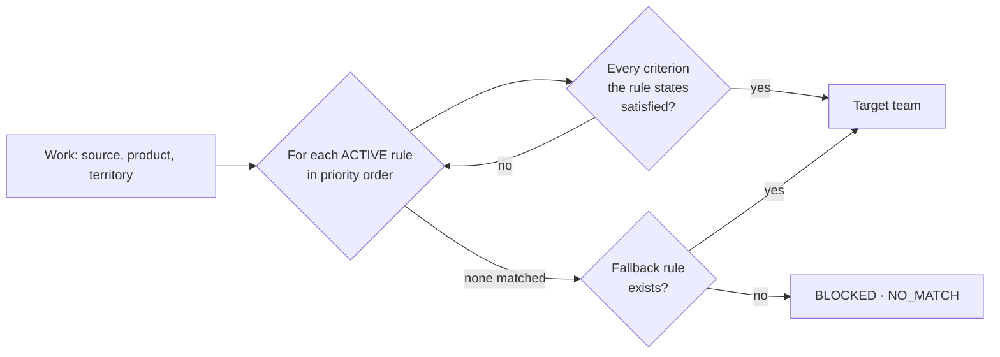
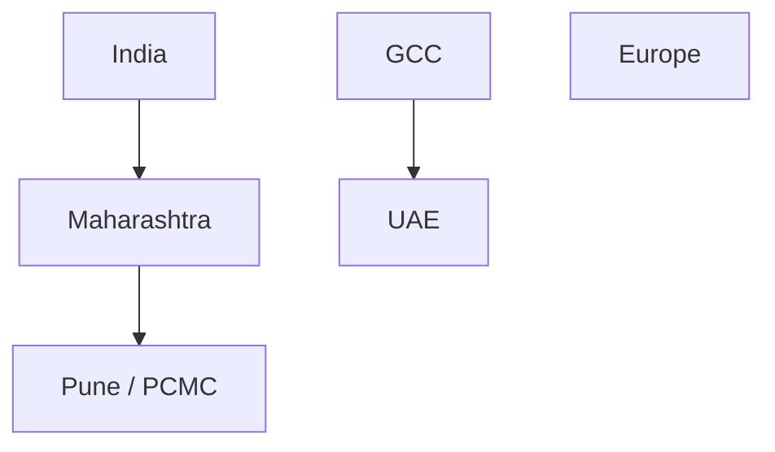
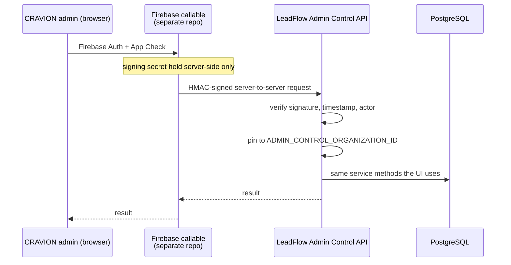
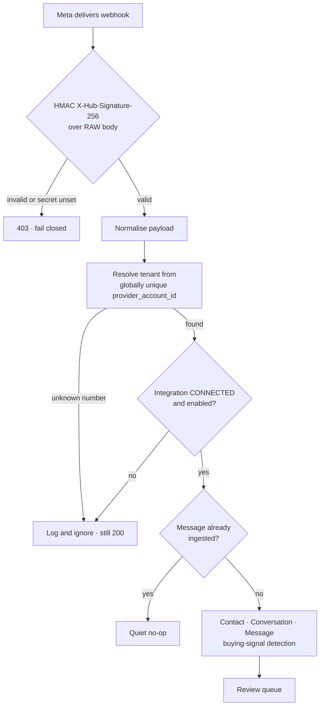

# CRAVION LeadFlow — Operations Runbook & User Guide

**Last verified against commit:** `679dba97658c91edc406124e391d58792e5690ad` (`main`)

---

## How to read this document

Every factual claim below was checked against the repository at the commit above,
and the file that proves it is cited. Where a fact depends on a value that lives
only in the deployment environment — a Railway variable, a Meta app setting, a row
in the production database — this document says so rather than guessing.

| Label | Meaning |
|---|---|
| **IMPLEMENTED** | The code exists in this repository and is covered by tests |
| **DISABLED BY DEFAULT** | Implemented, but off unless somebody turns it on |
| **NOT IMPLEMENTED** | No code exists. Do not promise it |
| **PLANNED** | Discussed, not built |
| **RECOMMENDED** | A suggestion in this document. Not current configuration |
| **VERIFY IN DEPLOYMENT ENVIRONMENT** | Cannot be proven from the repository |

**A standing caution.** Several sections describe the CRAVION Admin Panel, its
Firebase layer, and Railway variable values. None of those live in this
repository. What is documented here is the LeadFlow side of each boundary — the
contract it enforces — and the other side is marked for verification.

---

## Section 1 — Executive overview

### What LeadFlow is

LeadFlow is a multi-tenant sales CRM. Its purpose is one promise: **no lead left
behind.** Every active lead has an owner and a scheduled next step, and that is
enforced by a database constraint rather than a convention — the
`leads_active_requires_followup` CHECK constraint in `apps/api/prisma/migrations/`.

It is the **system of record** for leads, contacts, accounts, activities,
follow-ups and conversations. PostgreSQL 17 is the authoritative store; nothing
else is. Redis holds sessions, rate-limit counters and queues — all of it
reconstructible, none of it authoritative.

### CRAVION's use case

CRAVION VENTURES (OPC) PRIVATE LIMITED both operates LeadFlow as a product and
uses it as a tenant. That dual position is why `PLATFORM_OWNER` exists as a role
distinct from a tenant `OWNER` (Section 3), and why the Admin Control boundary is
pinned to exactly one organization (Section 2).

### The pieces

| Piece | Role | Lives in |
|---|---|---|
| LeadFlow API | HTTP surface, all business rules | `apps/api/src/main.ts` |
| LeadFlow worker | Background sweeps only | `apps/api/src/worker.ts` |
| LeadFlow web | The CRM UI operators use | `apps/web/` |
| PostgreSQL 17 | Authoritative CRM database | Railway managed |
| Redis | Sessions, throttles, queues | Railway managed |
| CRAVION Admin Panel | Control plane | **Separate repository** |

### API vs worker separation

Both processes are built from **one image** with different start commands
(`infrastructure/deployment/railway.api.toml`,
`infrastructure/deployment/railway.worker.toml`). The split matters:

* The API serves requests. `WORKER_ENABLED` defaults to `false`, so an API replica
  runs no sweeps — background work never competes with request latency.
* The worker runs sweeps and has **no HTTP listener**, which is why its Railway
  config deliberately has no `healthcheckPath`.
* **Exactly one worker replica.** Two would not double-notify — every marker is
  claimed conditionally — but would contend on the same rows for no benefit.



---

## Section 2 — Tenant / organization model

### The concept

An **organization** is a tenant. `users` is a *global* table — one person, one
email, possibly several organizations — and tenancy lives entirely in
`organization_users`. This is why a multi-organization user is asked to choose one
at login, and why an access token is scoped to a single organization.

### Tenant isolation — three layers

`docs/tenancy.md` is the authority. In summary:

1. **Server-derived context.** The organization comes from the signed token, never
   from a request body. `StripTenantFieldsInterceptor` deletes `organizationId`,
   `organization_id`, `orgId`, `org_id`, `tenantId` and `tenant_id` from every
   inbound body — **no exemptions by design**.
2. **Fail-closed Prisma scoping.** A `$extends` client extension injects the tenant
   predicate on every model in `TENANT_SCOPED_MODELS`
   (`apps/api/src/common/prisma/tenant-scope.extension.ts`). Missing context
   **throws** rather than running unscoped.
3. **Org A / Org B E2E suites.** A permanent cross-tenant test suite is part of the
   definition of done.

Background work enters a tenant explicitly via `runForOrganization` or
`runWithTenant`; privileged cross-tenant reads use `runAsSystem(reason)`, which is
greppable and audited.

**Cross-tenant misses return 404, not 403** — a 403 would confirm the id exists.

### Why Admin Control is pinned to one organization

`ADMIN_CONTROL_ORGANIZATION_ID` is a **configuration value, not a request
parameter** (`apps/api/src/common/config/env.schema.ts`). A signature proves *who
is calling*, not *what they may touch*. If the organization came from the request
body, one leaked shared secret would become access to every tenant on the
deployment. Config-pinning bounds a key compromise to a single organization.

The same pattern governs `WEBSITE_INTAKE_ORGANIZATION_ID`. Both are validated as
UUIDs at boot and are **required** when their feature is enabled — the process
refuses to start otherwise.

---

## Section 3 — User roles

Source of truth: `packages/api-types/src/permissions.ts`. Roles are **cumulative**
— each tier includes everything below it.

| Role | Tier | Assignable to a tenant user? |
|---|---|---|
| `SALES_REP` | base | yes |
| `MANAGER` | + team scope | yes |
| `ADMIN` | + organization administration | yes |
| `OWNER` | + billing | yes |
| `PLATFORM_OWNER` | + platform operations | **no — deliberately excluded from `ROLE_KEYS`** |

### SALES_REP

**Purpose:** sell. Works their own pipeline.

`LEAD_VIEW_OWN`, `LEAD_CREATE`, `LEAD_UPDATE`, `CONTACT_VIEW`, `ACCOUNT_VIEW`,
`ACCOUNT_CREATE`, `ACTIVITY_CREATE`, `ACTIVITY_VIEW`, `FOLLOW_UP_CREATE`,
`FOLLOW_UP_COMPLETE`, `DASHBOARD_VIEW_OWN`, `ORG_VIEW`.

**CRAVION usage:** every salesperson. **Must not** see colleagues' pipelines,
assign leads, invite users, or change organization settings.

### MANAGER

**Adds:** `LEAD_VIEW_TEAM`, `LEAD_ASSIGN`, `CONTACT_UPDATE`, `ACCOUNT_UPDATE`,
`ACCOUNT_STATUS_CHANGE`, `FOLLOW_UP_VIEW_TEAM`, `USER_VIEW`, `TEAM_VIEW`,
`ASSIGNMENT_RULE_VIEW`, `TERRITORY_VIEW`, `INTEGRATION_INTAKE_VIEW`,
`DASHBOARD_VIEW_TEAM`, `REPORT_VIEW`.

**CRAVION usage:** sales leads who reassign work and watch follow-up compliance.
Note they can **view** rules, territories and website enquiries but not change
them. **Must not** invite or remove users, or manage routing.

### ADMIN

**Adds:** `LEAD_VIEW_ALL`, `LEAD_DELETE`, `CONTACT_MERGE`, `ACCOUNT_MERGE`,
`LEAD_IMPORT`, `USER_INVITE`, `USER_UPDATE`, `USER_SUSPEND`, `USER_REMOVE`,
`ROLE_ASSIGN`, `TEAM_MANAGE`, `ASSIGNMENT_RULE_MANAGE`, `TERRITORY_MANAGE`,
`INTEGRATION_INTAKE_MANAGE`, `ORG_UPDATE`, `DASHBOARD_VIEW_ALL`.

**CRAVION usage:** the operations owner. This is the role that configures teams,
rules and territories, retries enquiries, and changes settings — including the
automation toggles in Section 15. **Must not** be the default for sales staff.

### OWNER

**Adds:** `SUBSCRIPTION_VIEW`, `SUBSCRIPTION_MANAGE`.

**CRAVION usage:** one or two people. Note the **last remaining administrator
cannot be removed, demoted or deactivated** — an organization cannot be left
unmanageable.

### PLATFORM_OWNER

**Adds:** platform-wide operations, **plus the whole tenant OWNER set**, because a
platform owner also runs CRAVION's own internal organization as an ordinary
tenant.

Deliberately kept out of `ROLE_KEYS` so it never appears in a role dropdown
(`packages/api-types/src/domain.ts`). Created only by
`apps/api/prisma/bootstrap-platform-owner.ts`.

**Critical:** holding `PLATFORM_OWNER` does **not** widen the Prisma tenant scope.
A platform owner signed into the internal organization still gets 404 for a
customer's lead. Cross-tenant reach requires the audited `runAsSystem` path.

---

## Section 4 — Lead lifecycle



### Lead numbering

Per organization, formatted `LD-00020`
(`apps/api/src/modules/leads/leads.repository.ts`). Allocated inside the
conversion transaction under the tenant's numbering lock, so a manual create and
an automated conversion cannot collide on a number.

### Duplicate prevention

Two mechanisms, and the second is the authority:

* A pre-check for an active lead on the same mobile.
* `leads_org_mobile_uniq`, a **partial unique index** on `(organization_id,
  mobile)` excluding lost leads — a genuinely lost lead may legitimately be
  re-created later.

The index closes the window a pre-check cannot. Two enquiries from one person
arriving together: both pre-checks pass, both proceed, the index refuses the
second, and the conversion records it as a duplicate.

### Contact reuse

A matching **contact** is never a reason to refuse — a returning customer is one
person with a second enquiry. The contact is reused, which keeps their history
together. A matching active **lead** is refused. Stated explicitly in
`apps/api/src/modules/integrations/intake-processing/intake-processing.service.ts`.

### Transaction guarantees

The whole conversion is **one transaction**: claim the intake, re-check duplicates,
resolve territory, evaluate rules, lock the team rotation, pick the agent,
create-or-reuse the contact, create the lead and its activities, create the first
follow-up, point the lead at it, mark the intake `PROCESSED`, advance the rotation.
Any subset would be a broken state somebody repairs by hand: a lead with no
follow-up breaks the product's promise; an advanced rotation with no lead silently
skips a salesperson's turn; a `PROCESSED` intake with no lead loses a customer.

### Audit trail

Conversions write audit rows: `integration.intake.processed`,
`integration.intake.blocked`, `integration.intake.duplicate_detected`,
`lead.auto_assigned`. Automated conversions carry `created_by = NULL` — the column
is nullable precisely so the system can say "not a person".

---

## Section 5 — Website enquiry flow

**Status: IMPLEMENTED. Boundary DISABLED BY DEFAULT.**

### The route

`POST /api/v1/integrations/website/intake`
(`apps/api/src/modules/integrations/website/website-intake.controller.ts`).

Gated by `WEBSITE_INTAKE_ENABLED` (**default `false`**). Disabled, it answers
**404** — an endpoint nobody configured should not announce itself.

Three headers prove the caller (`docs/production.md` §2):

| Header | Meaning |
|---|---|
| `X-LeadFlow-Timestamp` | unix seconds; accepted within five minutes either way |
| `X-LeadFlow-Event-Id` | the caller's id for the submission, and the idempotency key |
| `X-LeadFlow-Signature` | `sha256=<hex>` HMAC over timestamp, event id and body hash |

### IntegrationIntake statuses

Source: the `IntakeStatus` enum in `apps/api/prisma/schema.prisma`. **Five, and no
others.**

| Status | Meaning | Retriable? |
|---|---|---|
| `RECEIVED` | Stored, waiting for conversion | n/a — it *is* the queue |
| `PROCESSED` | Converted; `created_lead_id` is set | no |
| `BLOCKED` | Could not be converted; a code says why | **yes** |
| `FAILED` | Accepted but processing errored | **yes** |
| `DUPLICATE` | Looks like an existing customer; held for a person | **no — by design** |

`retry()` moves `BLOCKED` and `FAILED` back to `RECEIVED` so the pipeline re-runs
them. `DUPLICATE` deliberately refuses: a person must decide whether it is the
same customer.

### Block reasons

| Code | Cause | Fix |
|---|---|---|
| `NO_NAME` | No name on the submission | Blocked rather than inventing "Unknown" |
| `DUPLICATE_LEAD` | Active lead already exists for that mobile | A person decides |
| `NO_MATCH` | No assignment rule matched, and no fallback | Create a rule (Section 7) |
| `NO_ELIGIBLE_AGENTS` | Matching rule's team has nobody who can take work | Staff the team |

There is deliberately **no `DUPLICATE_CONTACT`** block.

### What prevents automatic lead creation

Three things, independently:

1. `WEBSITE_INTAKE_ENABLED=false` → nothing arrives at all.
2. `INTAKE_AUTO_PROCESSING_ENABLED=false` → enquiries are stored and left.
3. `WORKER_ENABLED=false` on every process → no sweep runs.

### `INTAKE_AUTO_PROCESSING_ENABLED` — read this before changing it

Default **`false`** (`apps/api/src/common/config/env.schema.ts`). Deployment-wide,
not per tenant.

**When `false`:** enquiries land durably at `RECEIVED` and stay there. The queue
logs *"Automatic intake processing is OFF … enquiries are stored and left for
manual conversion"* rather than failing silently. Conversion is available one at a
time via retry.

**When `true`** (and a worker is running): a repeatable sweep claims pending
intakes and converts them.

**The backlog risk — the single most important operational warning in this
document.** `IntakeProcessingRepository.pending()` selects `status: 'RECEIVED'`
with **no source filter and no age filter**, ordered `receivedAt: 'asc'` — oldest
first, by design, so a backlog is worked in the order customers wrote in.

`integration_intakes` is durable and may hold enquiries that arrived before any
automation existed. Switching this on **converts all of them**, assigns each to a
real salesperson, and creates a follow-up for each. Easy to do, very hard to undo:
the leads are real, the assignments are real, and the reminders go to people's
phones.

**Required pre-check.** Before enabling, read the backlog:

```
GET /api/v1/integration-intakes?status=RECEIVED     (INTEGRATION_INTAKE_VIEW)
```

Decide its fate first. Then enable.

### Manual retry

```
POST /api/v1/integration-intakes/:id/retry          (INTEGRATION_INTAKE_MANAGE)
```

Same `IntakeProcessingService.process()` the sweep uses — identical routing,
dedupe, assignment, follow-up and transaction. Manual conversion is not a lesser
path.

### In the Admin Panel

The LeadFlow side exposes `GET intakes`, `GET intakes/:id` and
`POST intakes/:id/retry` over Admin Control (Section 10). The panel's own Website
Enquiries screen is **VERIFY IN ADMIN PANEL REPO**.

---

## Section 6 — Sales teams & agents

**Status: IMPLEMENTED.** `apps/api/src/modules/teams/`.

### Operations

| Operation | Permission |
|---|---|
| Create / rename / archive a team | `TEAM_MANAGE` |
| Add a member | `TEAM_MANAGE` |
| Remove a member | `TEAM_MANAGE` |
| Change a member's rotation state | `TEAM_MANAGE` |
| View teams | `TEAM_VIEW` |

### Agent eligibility

`apps/api/src/modules/teams/agent-eligibility.ts` decides who can receive assigned
work *right now*. Routing chooses only among eligible agents, and the list is read
**inside** the conversion transaction, after the rotation lock — so an agent
suspended a moment earlier cannot be assigned.

If a matching rule's team has no eligible agent, conversion blocks with
`NO_ELIGIBLE_AGENTS`. **There is no fallback to a manager.** An unstaffed team is a
configuration problem, and routing around it would hide it.

### Round-robin

Each team has a rotation cursor. Conversion locks it, picks the next eligible agent
in order, and advances it — inside the same transaction as the lead, so an advanced
cursor with no lead is impossible.

### Archiving a team

A team archived while assignment rules still point at it is **refused**, in Admin
Control exactly as in the UI, because it is the same service method. "Admin" is not
a reason to bypass a business rule.

### RECOMMENDED CRAVION team structure — NOT CURRENT CONFIGURATION

Suggestions only. No teams named below exist in the repository or, as far as this
document can prove, in production.

| Team | Covers |
|---|---|
| Domestic Sales | India enquiries |
| Export Sales | Outside India |
| HoReCa / Institutional | Hotels, restaurants, caterers, institutions |
| Distributor / Channel Sales | Resellers and distributors |

---

## Section 7 — Assignment rules

**Status: IMPLEMENTED.** `apps/api/src/modules/assignment-rules/`.

### How matching works

Source of truth: `rule-criteria.ts`. **Three dimensions, combined with AND:**

* `source` — free text, normalised
* `productId` — a canonical product id, never free text
* `territoryId` — a *resolved* territory id, never a country or city string

Two rules that are easy to get backwards:

1. **A dimension the rule leaves unset matches anything.**
2. **A rule that states a criterion the work does not carry does not match.** An
   enquiry with no product is not "any product" — it is a fact we do not have, and
   routing by it would be a guess.



### Priority

Rules carry an integer `priority` and are evaluated in order. The database refuses
two ACTIVE rules whose normalised criteria are identical and whose answers
disagree — the criteria key uses `*` for an unconstrained dimension, so "any
source, product X" and "source Y, product X" are different keys.

### Rule preview — IMPLEMENTED

`POST /api/v1/integrations/admin-control/assignment-rules/preview` shows what a
rule would match **without writing anything**. Use it before saving.

### Source values

**CURRENTLY SUPPORTED — values the code actually emits:**

| Value | Emitted by |
|---|---|
| `WEBSITE` | `apps/api/src/modules/integrations/website/website-intake.service.ts` |
| `WHATSAPP` | `apps/api/src/modules/omnichannel/ingestion.service.ts` |

Anything else in a rule is a value a **person** typed, either on a lead or in the
tenant's own `leadSources` list. Matching is spelling-insensitive:
`normalizeSourceKey` lower-cases and collapses whitespace, so `WHATSAPP` matches a
rule a tenant spelled `WhatsApp`.

**RECOMMENDED FUTURE SOURCE TAXONOMY — NOT IMPLEMENTED as automatic values.**
`EXPORT`, `SAMPLE`, `BULK`, `HORECA` are useful for manually created leads and for
the tenant's `leadSources` list, but **no integration emits them**. A rule scoped
to one of these will never match an automated intake.

### CRAVION examples — RECOMMENDED

| Rule | Source | Territory | Team |
|---|---|---|---|
| Website → Domestic | `WEBSITE` | India | Domestic Sales |
| WhatsApp → Domestic | `WHATSAPP` | unset | Domestic Sales |
| Export enquiries | `WEBSITE` | GCC / Europe | Export Sales |
| Catch-all | fallback | unset | Domestic Sales |

---

## Section 8 — Territories

**Status: IMPLEMENTED.** `apps/api/src/modules/territories/`.

### Purpose

A territory turns **geography into one resolved id** before the routing table sees
it. Rules match on a territory id, never on a city string — otherwise every rule
would need its own private geography database.

### Coverage

A territory has coverage entries (`TerritoryCoverage`). `TerritoriesService.resolve`
normalises the location facts it is given, builds candidate coverage keys, and
returns the first live match — most specific first.

### What happens when country is null

`resolve` returns `NO_TERRITORY` when there are no candidates. Conversion then
evaluates rules with `territoryId: null`.

**This is the WhatsApp case, and it matters.** A WhatsApp intake carries **no
country** — nothing in this repository derives one from a phone prefix safely — so
territory is always null for it.

What that requires is **an active rule that does not constrain territory**:

| Rule | Matches a null-territory intake? |
|---|---|
| `source = WHATSAPP`, territory unset | **yes — recommended** |
| all dimensions unset (a fallback) | yes, and catches everything else too |
| any rule with a territory set | **no** |

Prefer the source-scoped rule: it routes WhatsApp to a team you chose rather than
wherever the catch-all points.

### RECOMMENDED CRAVION territory structure — NOT CURRENT CONFIGURATION



Nothing above exists in the repository. Build territories only as deep as your
routing actually distinguishes — a level nobody routes on is a level nobody
maintains.

---

## Section 9 — Admin Panel integration

**Status: IMPLEMENTED on the LeadFlow side. DISABLED BY DEFAULT.**



### Properties LeadFlow enforces

* **No browser secrets.** The signing secret never reaches a browser. The browser
  talks to Firebase; Firebase talks to LeadFlow.
* **No direct PostgreSQL access from the panel.** Every operation goes through a
  named LeadFlow method.
* **An allowlist, not a proxy.** No route accepts a controller name, model or path
  to dispatch on. Adding an operation is a deliberate act with a diff.
* **Business rules are not bypassed.** Admin Control calls the same services the
  human UI calls.
* **CORS, Origin, Referer, User-Agent and source IP take no part in
  authentication** — all of them are set by the caller.
* Excluded from API docs (`@ApiExcludeController`).

### Headers LeadFlow requires

From `admin-control.controller.ts`:

| Header | Purpose |
|---|---|
| `x-cravion-admin-signature` | HMAC over the request |
| `x-cravion-admin-timestamp` | replay window |
| `x-cravion-admin-actor` | who, in the panel, is acting |
| `x-cravion-admin-request-id` | idempotency / ledger correlation |

### Configuration

| Variable | Default | Notes |
|---|---|---|
| `ADMIN_CONTROL_ENABLED` | `false` | Disabled ⇒ every route answers **404** |
| `ADMIN_CONTROL_ORGANIZATION_ID` | — | **Required** when enabled; UUID validated at boot |
| `ADMIN_CONTROL_SIGNING_SECRET` | — | **Required** when enabled. Never printed, never logged |

Rotating the secret: set the new value and redeploy. There is no overlap window,
so coordinate with whoever operates the panel.

### Panel pages

The pages named — Overview, Sales Teams, Assignment Rules, Territories, Website
Enquiries — are **VERIFY IN ADMIN PANEL REPO**; they are not in this repository.
What LeadFlow supports for each is in Section 10, and that determines read-only
versus mutation-capable:

| Panel area | LeadFlow capability |
|---|---|
| Overview | read only (`GET summary`) |
| Sales Teams | read **and** mutate |
| Assignment Rules | read, **preview**, and mutate |
| Territories | read, **resolve**, and mutate |
| Website Enquiries | read, and **retry** |

`leadflow.read` / `leadflow.manage` do **not exist in this repository** — no such
scope is referenced anywhere in `apps/api/src`. They are presumably Firebase custom
claims on the panel side: **VERIFY IN ADMIN PANEL REPO.**

---

## Section 10 — Central Admin Control API

All routes are prefixed `/api/v1/integrations/admin-control`. **24 operations**,
counted from `admin-control.controller.ts`.

Every operation is pinned to `ADMIN_CONTROL_ORGANIZATION_ID`. Authentication is the
HMAC signature on every request — there is no per-route permission decorator,
because there is no session and no LeadFlow user. Authorisation of the *human* is
the panel's job (**VERIFY IN ADMIN PANEL REPO**).

### READ — 12 operations, none change production data

| # | Operation | Purpose |
|---|---|---|
| 1 | `GET summary` | Overview counters for the panel landing page |
| 2 | `GET teams` | List sales teams |
| 3 | `GET teams/:id` | One team, with members |
| 4 | `GET agents` | People who could be team members |
| 5 | `GET assignment-rules` | List routing rules |
| 6 | `GET assignment-rules/:id` | One rule |
| 7 | `GET territories` | List territories |
| 8 | `GET territories/:id` | One territory, with coverage |
| 9 | `GET intakes` | Website / WhatsApp enquiries; filterable by status |
| 10 | `GET intakes/:id` | One enquiry, with its failure reason |
| 11 | `POST assignment-rules/preview` | What a rule *would* match. **Writes nothing** |
| 12 | `POST territories/resolve` | What a location *would* resolve to. **Writes nothing** |

11 and 12 are `POST` only because they take a body. They are reads.

### WRITE — 12 operations, all change production data

Each is recorded in the command ledger **inside the same transaction** as the
change, so a ledger entry without its change cannot exist.

| # | Operation | Purpose | Major constraints |
|---|---|---|---|
| 13 | `POST teams` | Create a team | Name unique per organization |
| 14 | `PATCH teams/:id` | Rename / archive | Archiving refused while ACTIVE rules target it |
| 15 | `POST teams/:id/members` | Add a member | Must be an active organization member |
| 16 | `POST teams/:id/members/:memberId/remove` | Remove a member | Rotation stays consistent |
| 17 | `PATCH teams/:id/members/:memberId` | Change member state | Affects eligibility immediately |
| 18 | `POST assignment-rules` | Create a rule | Refused if criteria duplicate an ACTIVE rule with a different answer |
| 19 | `PATCH assignment-rules/:id` | Edit / archive a rule | Same duplicate-criteria refusal |
| 20 | `POST territories` | Create a territory | Name unique per organization |
| 21 | `PATCH territories/:id` | Edit / archive | Archiving affects routing |
| 22 | `POST territories/:id/coverage` | Add coverage | Overlap rules apply |
| 23 | `POST territories/:id/coverage/:coverageId/remove` | Remove coverage | May leave enquiries unroutable |
| 24 | `POST intakes/:id/retry` | Re-run one conversion | `DUPLICATE` refused; `BLOCKED`/`FAILED` reset to `RECEIVED` |

**Operation 24 creates leads, assigns salespeople and schedules follow-ups.** It is
the write that sounds most like a read — treat it with the most care.

No signing secret value appears anywhere in this document.

---

## Section 11 — Omnichannel

**Status: IMPLEMENTED. Per-tenant display flag DISABLED BY DEFAULT.**
Module: `apps/api/src/modules/omnichannel/`.

### Channels

`ChannelType` in `apps/api/prisma/schema.prisma` has exactly three values:
`WHATSAPP`, `FACEBOOK`, `INSTAGRAM`. There are no others.

### Webhook flow



Routes: `GET`/`POST` on `/api/v1/webhooks/whatsapp`, `/api/v1/webhooks/instagram`,
`/api/v1/webhooks/facebook`. `GET` is the Meta subscription handshake; `POST`
carries events.

### Security properties

| Property | How |
|---|---|
| HMAC over **raw** bytes | `rawBody: true` in `main.ts`; a re-serialised body would verify wrongly |
| Fail closed | An unset app secret rejects **every** request |
| Constant-time compare | `timingSafeEqual`, for signature and verify token |
| Replay protection | Unique index `(organization_id, channel, external_message_id)` |
| Tenant mapping | Unique index `(channel, provider_account_id)` — **global, no organization id**, which is what makes resolution total |
| Never trusts payload | The organization comes from the resolved integration |
| Token storage | AES-256-GCM via `apps/api/src/common/crypto/secret-box.ts`; a database dump alone is inert |
| No token in frontend | Write-only; only a non-secret hint is returned |

An unknown number is **acknowledged with 200** and ignored. Meta retries any
non-2xx for hours, so erroring on a message that will never succeed would create an
endless redelivery loop.

### Identity resolution

`identity-resolution.service.ts` maps a channel identity to a contact. Deliberately
conservative: if nobody can be identified with confidence it records
`UNRESOLVED` and stores the message anyway. It never invents a contact and never
merges contacts.

### Inbox and Channel Review

| Screen | Route | Gate |
|---|---|---|
| Inbox | `/inbox` | nav gated on `omnichannelEnabled` |
| Channel review | `/leads/review` | nav gated on `omnichannelEnabled` |
| Channels (setup) | `/settings/channels` | **not gated** — it is where you enable it |

API: `GET /api/v1/conversations`, `/inbox`, `/inbox/counts`, `/review`,
`/review/count`, `/:id`; `POST /:id/messages`, `/template-messages`, `/link`,
`/unlink`, `/assign`, `/archive`, `/restore`.

### Buying-signal detection

`lead-signals.ts` — a readable word list matched on word boundaries, not a model.
Its own comment is explicit: *"This ONLY decides which pile a conversation lands
in."* A conversation flagged as a potential lead appears in Channel Review.

### Outbound

**IMPLEMENTED for all three channels** (`outbound-messaging.service.ts` dispatches
`WHATSAPP`, `INSTAGRAM`, `FACEBOOK`). Each has a 24-hour reply window. **Only
WhatsApp** can reopen a closed conversation, with an approved template.

### Current production status

| Item | Status |
|---|---|
| Meta app setup | **ON HOLD** (operator-reported; **VERIFY IN DEPLOYMENT ENVIRONMENT**) |
| WhatsApp automated lead creation | **IMPLEMENTED**, tenant flag defaults `false` |
| Instagram automated lead creation | **NOT IMPLEMENTED** |
| Facebook automated lead creation | **NOT IMPLEMENTED** |
| Comment ingestion (any channel) | **NOT IMPLEMENTED** |
| Comment-to-lead | **NOT IMPLEMENTED** |
| Meta Lead Ads | **NOT IMPLEMENTED** |

Evidence for the "not implemented" rows: the WhatsApp normaliser accepts only
`change.field === 'messages'`, and the Messenger normaliser iterates
`entry.messaging` only — the DM envelope. Comments arrive under
`changes[].field = 'feed'` / `'comments'` and Lead Ads under `'leadgen'`; none is
handled anywhere in the module's history.

**Why WhatsApp only for auto-lead.** A `wa_id` is a real phone number, so an
enquiry can be de-duplicated against existing leads by the same partial unique
index every other lead uses. Instagram and Messenger supply a scoped user id and no
number — the same automation there would have nothing to de-duplicate on, and two
DMs from one person would become two leads.

### Two separate controls — do not confuse them

| Control | Scope | Governs |
|---|---|---|
| `whatsappAutoLeadEnabled` | **per tenant**, a column on `organization_settings` | whether a WhatsApp **buying enquiry** is recorded as an intake |
| `INTAKE_AUTO_PROCESSING_ENABLED` | **deployment-wide** env var | whether the sweep **converts** any intake — website or WhatsApp |

They are deliberately separate. Sharing one switch would mean a tenant enabling
WhatsApp automation also converted the entire stored website backlog at once.

**They sit in series.** With only the tenant flag on, WhatsApp enquiries accumulate
at `RECEIVED`, visible under Website enquiries and convertible one at a time. That
is a legitimate way to run it — a person still decides, but the enquiry arrives
already parsed.

---

## Section 12 — Email & authentication

**Status: IMPLEMENTED.** `apps/api/src/modules/auth/`.

### Endpoints

`POST /api/v1/auth/` + `login`, `register`, `refresh`, `logout`,
`forgot-password`, `change-password`, `verify-email`, `verify-email/resend`,
`google`, `google/register`, `switch-organization`;
`GET /api/v1/auth/` + `me`, `organizations`, `sessions`, `providers`.

### Mandatory email verification

A local registration creates the organization, user, membership and OWNER role —
and issues **no access token and no refresh cookie**. Login and refresh both refuse
an unverified account with `EMAIL_VERIFICATION_REQUIRED`.

| Property | Value |
|---|---|
| Token | 32 random bytes; only the SHA-256 is stored |
| Lifetime | 24 hours, single use |
| Resend | Spends the previous link — never more than one live link |
| Resend budget | 5 per hour per account, independent of the route throttle |
| Enumeration safety | The resend response is identical for an unverified account, a verified one, and an address with none — **including when rate-limited** |

Two flows prove a mailbox another way and are exempt: accepting an emailed
invitation, and a Google identity asserting a verified address.

Accounts that existed before this shipped were **grandfathered at rollout**
(migration `20260925090000_email_verification` stamps `now()`). Read a pre-rollout
`email_verified_at` as a policy decision, **not** as evidence anybody confirmed an
address.

### Email transport

`EMAIL_PROVIDER` — default `console`. Implemented providers: `console`, `smtp`,
`resend` (`apps/api/src/common/email/providers/`). `console` is refused in
production.

Railway blocks outbound SMTP, which is why the Resend HTTPS provider exists. The
API key is sent only in an `Authorization` header and is scrubbed from logs. The
code says "accepted", never "delivered" — provider acceptance is not an inbox.

Production value: **VERIFY IN DEPLOYMENT ENVIRONMENT.** (Operator-reported as
`resend` with `cravionventures.com` verified.)

### Sessions and refresh rotation

| Property | Behaviour |
|---|---|
| Access token | Short-lived, held in memory on web |
| Refresh token | Opaque; only the SHA-256 is stored |
| Rotation | Every refresh issues a new pair and revokes the old |
| Reuse detection | Presenting a spent token revokes the **whole family** and audits it |
| Rotation grace | A short interval tolerates a genuine straggler without killing the family; `REFRESH_REUSE_INTERVAL_MS=0` disables grace entirely |
| Logout | Revokes the session and adds the `jti` to a Redis deny-list |
| Password change | Signs other devices out |

Passwords are hashed with argon2id (`ARGON2_MEMORY_COST`, `ARGON2_TIME_COST`,
`ARGON2_PARALLELISM`). **Idle-timeout auto-logout: NOT IMPLEMENTED** — sessions end
by token expiry, explicit logout, or revocation.

---

## Section 13 — Production deployment

**Railway project: CRAVION LeadFlow Production.** Service names and variable values
are **VERIFY IN DEPLOYMENT ENVIRONMENT**; the repository proves only the intended
topology.

| Service | Start command | Replicas | Healthcheck |
|---|---|---|---|
| LeadFlow API | `node apps/api/dist/main.js` | 1 (scale as needed) | `/health`, 30s |
| LeadFlow worker | `node apps/api/dist/worker.js` | **exactly 1** | **none by design** |
| PostgreSQL 17 | managed | — | — |
| Redis | managed | — | — |

Both from one Dockerfile: `infrastructure/deployment/Dockerfile`.

### Why the healthcheck is `/health` and not `/readiness`

Railway restarts a container that fails its healthcheck. `/readiness` reports
unhealthy when Redis or the database is briefly unavailable, so pointing the
healthcheck at it would turn a thirty-second Redis blip into a restart loop —
converting a degraded dependency into an outage. `/readiness` is the right thing to
**alert** on, and the wrong thing to **restart** on.

### Endpoints

| Endpoint | Prefix | Purpose |
|---|---|---|
| `/health` | **excluded from the `api` prefix** | Liveness. Does not touch `users` |
| `/readiness` | **excluded from the `api` prefix** | Dependency health. Alert on this |
| `/api/metrics` | under the prefix | Counters, including `database.query_failures` |

The exclusions are set in `main.ts`: `setGlobalPrefix('api', { exclude: ['health',
'readiness'] })`.

### Worker ownership

The worker owns the follow-up sweep and website-intake auto-processing. It does
**not** own omnichannel ingestion — that runs synchronously in the API during the
webhook request, and there is no omnichannel queue in `apps/api/src/queues/`.

`OUTBOUND_RECOVERY_ENABLED` (default **`true`**) runs a stale-outbound sweep in
whichever process has it set.

### Migrations and bootstrap

Migrations create the schema. They do **not** create reference data — permissions,
the four system roles with their grants, and the plan catalogue. Without
`db:bootstrap`, a freshly migrated database has no OWNER role and
`POST /auth/register` fails.

---

## Section 14 — Database migrations

**Current count: 35** migration directories under `apps/api/prisma/migrations/` at
the verified commit. Most recent three:

| Migration | What it adds |
|---|---|
| `20260924090000_platform_owner` | Platform owner role support |
| `20260925090000_email_verification` | `users.email_verified_at` + token table; grandfathers existing accounts |
| `20260925120000_whatsapp_auto_lead` | `organization_settings.whatsapp_auto_lead_enabled`, default `false` |

### Safe procedure

Run from the **API workspace**, not the repository root:

```bash
# 1. Status first — read-only, proves what is pending.
cd apps/api && npx prisma migrate status

# 2. Apply. Only if step 1 reports something pending.
npm run db:migrate:deploy -w apps/api

# 3. Confirm.
cd apps/api && npx prisma migrate status
```

**The working directory matters.** Prisma 7 loads `apps/api/prisma.config.ts` from
the *current* directory, and that file supplies `datasource.url`. Invoked from the
repository root with only `--schema`, the config is never loaded and the command
fails with *"The datasource.url property is required"*. `npm run -w apps/api` sets
the working directory for you; the bare `npx prisma` form needs the `cd`. This is
documented in `.github/workflows/ci.yml`, which uses the correct form.

`prisma.config.ts` prefers `DIRECT_DATABASE_URL` over `DATABASE_URL`: migrations
take advisory locks and run DDL, neither of which survives a transaction-mode
pooler. **Confirm `DIRECT_DATABASE_URL` is set on the runner** — absent, it falls
back silently to the pooled URL.

### Expected output

Pending:

```
35 migrations found in prisma/migrations
Following migrations have not yet been applied:
20260925120000_whatsapp_auto_lead
```

Applying:

```
Applying migration `20260925120000_whatsapp_auto_lead`
All migrations have been successfully applied.
```

Then: `Database schema is up to date!`

### Why redeploying an old artifact is unsafe

A Railway redeploy of an existing artifact rebuilds nothing — it reruns the image
that was built from the commit it was built from. A runner artifact built before a
migration existed **does not contain that migration file**, so `migrate deploy`
finds nothing to apply and reports success. The schema stays behind while the
deploy looks clean.

This is not hypothetical: it is exactly how the post-PR-#6 login outage happened —
the API shipped code expecting `users.email_verified_at` while the runner still
held a 33-migration image.

**A fresh build from the latest `main` is required.** An empty commit is the
standard way to force one:

```bash
git commit --allow-empty -m "chore: trigger <name> production migration"
git push origin main
```

**After applying, verify `migrations found` equals the repository count (35)** — not
just that the command exited zero.

---

## Section 15 — Production safety switches

Defaults from `apps/api/src/common/config/env.schema.ts`. **Production values are
VERIFY IN DEPLOYMENT ENVIRONMENT** — this repository cannot prove them, and this
document does not guess.

| Control | Scope | Default | Enabling it… | Risk | Pre-checks |
|---|---|---|---|---|---|
| `ADMIN_CONTROL_ENABLED` | deployment | `false` | Opens the signed Admin Control surface; 404 when off | Key compromise = write access to the pinned organization | Secret set; `ADMIN_CONTROL_ORGANIZATION_ID` set and correct |
| `ADMIN_CONTROL_ORGANIZATION_ID` | deployment | — | Pins every Admin Control write to one tenant | Wrong id ⇒ writes land in the wrong organization | Required when enabled; UUID checked at boot |
| `ADMIN_CONTROL_SIGNING_SECRET` | deployment | — | The HMAC key | Leak ⇒ forged admin writes | Never in a browser, log or document |
| `WEBSITE_INTAKE_ENABLED` | deployment | `false` | Opens one signed intake route; 404 when off | Unsigned traffic is refused, so low | `WEBSITE_INTAKE_ORGANIZATION_ID` set; website holds the secret |
| `INTAKE_AUTO_PROCESSING_ENABLED` | deployment | `false` | Sweep converts **all** pending intakes, oldest first | **HIGH — converts the entire backlog** | **Read the `RECEIVED` backlog first.** Rules configured, teams staffed |
| `WORKER_ENABLED` | **per process** | `false` | That process runs sweeps | Two worker replicas contend | Exactly one replica; never on an API replica |
| `whatsappAutoLeadEnabled` | **per tenant** (DB column) | `false` | WhatsApp buying enquiries become intakes | Medium — real leads, real assignments | A rule that does not constrain territory; team staffed |
| `omnichannelEnabled` | **per tenant** (DB column) | `false` | Shows Inbox and Channel review in the nav | **None — display only.** It does not gate ingestion or the API | — |
| `OUTBOUND_RECOVERY_ENABLED` | per process | **`true`** | Sweeps stale outbound messages | Low | — |
| `INTAKE_SWEEP_BATCH_SIZE` | deployment | `25` (max 500) | Intakes converted per sweep | Large values convert a backlog faster | Lower it while draining a backlog |
| `FOLLOW_UP_SWEEP_INTERVAL_SECONDS` | deployment | `60` | How often follow-ups are re-bucketed | Low | — |
| `EMAIL_PROVIDER` | deployment | `console` | `console` \| `smtp` \| `resend`. `console` refused in production | Misconfigured ⇒ **new signups cannot complete** | Send one real reset to a mailbox you control |
| `CREDENTIAL_ENCRYPTION_KEY` | deployment | — | Required to connect any channel | **Changing it makes stored tokens permanently undecryptable** | Set once, before any connect |
| `TRUST_PROXY_HOPS` | deployment | `0` | How far to walk `X-Forwarded-For` | **Too high silently disables rate limiting** | Count real proxies; verify against an audit row |

**A note on `omnichannelEnabled`.** The name sounds like a security control. It is
not. It decides whether two nav items appear. What actually governs whether a
message is accepted is the integration's own `status` and `enabled` columns,
checked per webhook — per connected account, and fail-closed.

---

## Section 16 — Daily operating procedure

A practical SOP. Everything here uses screens and endpoints that exist.

### Morning (15 minutes)

1. **Health.** `/health` returns 200; `/readiness` is healthy. If the worker is
   running, confirm its heartbeat is recent (`worker.lastSweepAt` on
   `/api/metrics`).
2. **Dashboard.** Overdue follow-ups first — that is the number that means a
   customer is waiting.
3. **Website enquiries.** Filter `BLOCKED` and `FAILED`. Each has a reason code
   (Section 5). Fix the cause, then retry.
4. **`DUPLICATE` enquiries.** These wait for a human by design. Decide: same
   customer, or a genuinely new enquiry?
5. **Unassigned leads.** Anything with no owner is outside the product's promise.
6. **Today's follow-ups** by team.

### During the day

* Retry enquiries whose cause you fixed — retry is safe and idempotent.
* Before changing a routing rule, use **preview**. Before changing coverage, use
  **resolve**.
* When somebody joins or leaves a team, check the rotation: removing the last
  eligible agent turns every future enquiry for that team into
  `NO_ELIGIBLE_AGENTS`.
* Never leave a team archived while a rule still targets it — the API refuses it
  anyway.

### End of day

1. **Follow-up backlog.** Anything overdue and unactioned.
2. **Failed and blocked intakes** created today.
3. **Unassigned leads** created today.
4. **Audit review** on a day when settings changed — particularly
   `ORGANIZATION_UPDATED`, `lead.auto_assigned`, and the Admin Control command
   ledger.

### Weekly

* Follow-up completion rate per person (Reports → Team performance).
* Whether `NO_MATCH` blocks are recurring — that is a missing rule, not bad luck.
* Confirm exactly one worker replica is running.

---

## Section 17 — Troubleshooting

### Matrix

| Symptom | Likely meaning | Check | Recovery |
|---|---|---|---|
| Panel says "LeadFlow not available" | Boundary off, or Firebase cannot reach it | `ADMIN_CONTROL_ENABLED`; Firebase function config; network | Enable the flag, redeploy, retry one read |
| Admin Control returns **404** | `ADMIN_CONTROL_ENABLED=false` — the route is hidden | The flag | Set `true`; requires organization id **and** secret, or boot fails |
| Admin Control returns **401** | HMAC rejected | Secret matches on both sides; timestamp within the window; clock skew | Re-sync the secret; check the caller's clock |
| Admin Control returns **403/404** on a valid-looking id | The id belongs to another organization | `ADMIN_CONTROL_ORGANIZATION_ID` | Point it at the right tenant. Do not widen the boundary |
| Website enquiry stays `RECEIVED` | Nothing is converting | `INTAKE_AUTO_PROCESSING_ENABLED`; a worker actually running; `WORKER_ENABLED=true` on it | Convert manually via retry, or enable the sweep **after** reading the backlog |
| No lead created from an enquiry | It blocked. The reason is stored | The intake's status and code (Section 5) | `NO_NAME` → a person handles it · `DUPLICATE_LEAD` → decide · `NO_MATCH` → add a rule · `NO_ELIGIBLE_AGENTS` → staff the team. Then retry |
| WhatsApp enquiries never become leads | Two switches in series | `whatsappAutoLeadEnabled` on the tenant; then `INTAKE_AUTO_PROCESSING_ENABLED` + worker | Enable the tenant flag first; convert manually to validate before enabling the sweep |
| Every WhatsApp enquiry blocks `NO_MATCH` | No rule matches a null territory | Rules with territory **unset** | Add a `source = WHATSAPP` rule with territory unset |
| Webhook returns 403 | Signature failed, or the app secret is unset | `{CHANNEL}_APP_SECRET`; that the raw body is intact | Set the secret. Fail-closed is intentional |
| Webhooks arrive but nothing appears | Unknown number, or integration not `CONNECTED`/`enabled` | The integration row | Connect the account; confirm `provider_account_id` matches |
| Login and registration both fail with "An unexpected error occurred." | Deployed code expects schema the database does not have | `migrate status`; whether the runner built from latest `main` | Apply the migration from a **fresh** build (Section 14) |
| Migration not picked up | The runner redeployed an **old artifact** | `migrations found` count vs repository count; the runner's build commit | Push an empty commit to force a fresh build |
| Signups succeed but no email arrives | Provider misconfigured or rejected | `EMAIL_PROVIDER`; provider logs; whether the domain is verified | Fix config, then use resend. Never claim delivery |
| Rate limiting appears absent | `TRUST_PROXY_HOPS` too high | Compare an audit row's IP against the real client | Set it to the real hop count |
| Follow-ups never change bucket | No worker | `WORKER_ENABLED` on the worker service | Run exactly one worker replica |

### Recovery principles

1. **Read before writing.** `migrate status`, the intake's stored reason, the audit
   row. Every failure path here records why.
2. **Nothing is silently dropped.** A blocked enquiry is durable and retriable; a
   flagged conversation stays in review.
3. **Retry is safe.** `retry()` and `process()` are idempotent — a second run finds
   the row already `PROCESSED` and returns the original lead id.
4. **Do not widen a boundary to fix a 404.** A cross-tenant 404 is the isolation
   layer working.
5. **A green exit code is not a green outcome.** Check the reported counts.

---

## Section 18 — Security

| Control | Implementation |
|---|---|
| Webhook authenticity | HMAC-SHA256 over the **raw** body; `timingSafeEqual`; fail-closed on an unset secret |
| Admin Control authenticity | HMAC + timestamp + actor + request id headers |
| Replay protection | Timestamp windows, plus unique indexes on provider event ids |
| Idempotency | `(organization_id, source, external_event_id)` for intakes; `(organization_id, channel, external_message_id)` for messages |
| Tenant scoping | Fail-closed Prisma extension; `organizationId` stripped from every request body |
| Cross-tenant enumeration | 404, never 403 |
| Secret storage | Environment only. Provider credentials AES-256-GCM encrypted at rest |
| No browser secrets | Signing secrets live server-side; the panel calls Firebase, Firebase calls LeadFlow |
| No direct DB access from the panel | Every operation is a named LeadFlow method |
| Role enforcement | Server-side on every route — never by hiding a button |
| Password storage | argon2id, tunable cost |
| Session revocation | Refresh rotation with family reuse detection; Redis `jti` deny-list |
| Audit trail | Actor, action, entity, before/after, IP, request id |
| API docs exposure | Webhooks and Admin Control excluded from Swagger |

**Firebase App Check and Firebase Auth** are enforced on the panel side:
**VERIFY IN ADMIN PANEL REPO.** LeadFlow does not see a Firebase identity — it sees
a signature and an actor header.

**Audit principles.** Automated actions record `created_by = NULL` rather than
borrowing a human's identity. Settings changes capture before/after values —
including `omnichannelEnabled`, `sharedUnassignedQueue` and
`whatsappAutoLeadEnabled`, so "who switched automatic lead creation on, and when"
is answerable. Secrets, tokens and verification links are never logged.

---

## Section 19 — Current production status

Evidence is repository-only unless marked otherwise.

| Area | Implementation | Production state |
|---|---|---|
| Tenant isolation | **IMPLEMENTED**, 3 layers + E2E suites | Active |
| Roles & permissions | **IMPLEMENTED**, 5 roles cumulative | Active |
| Lead lifecycle | **IMPLEMENTED** | Active |
| Website intake boundary | **IMPLEMENTED** | Default `false` — **VERIFY IN DEPLOYMENT ENVIRONMENT** |
| Intake auto-processing | **IMPLEMENTED** | Default `false` — **VERIFY IN DEPLOYMENT ENVIRONMENT** |
| Admin Control API | **IMPLEMENTED**, 24 operations | Default `false` — **VERIFY IN DEPLOYMENT ENVIRONMENT** |
| Admin Panel integration | LeadFlow side **IMPLEMENTED** | Panel itself **VERIFY IN ADMIN PANEL REPO** |
| Sales teams / agents / round-robin | **IMPLEMENTED** | Active; team data **VERIFY IN DEPLOYMENT ENVIRONMENT** |
| Assignment rules (+ preview) | **IMPLEMENTED** | Rule data **VERIFY IN DEPLOYMENT ENVIRONMENT** |
| Territories (+ resolve) | **IMPLEMENTED** | Territory data **VERIFY IN DEPLOYMENT ENVIRONMENT** |
| Omnichannel capture (3 channels) | **IMPLEMENTED** | `omnichannelEnabled` default `false` per tenant |
| Omnichannel outbound (3 channels) | **IMPLEMENTED** | Requires a connected account |
| WhatsApp auto-lead | **IMPLEMENTED** | `whatsappAutoLeadEnabled` default `false` |
| Instagram / Facebook auto-lead | **NOT IMPLEMENTED** | — |
| Comment ingestion, comment-to-lead | **NOT IMPLEMENTED** | — |
| Meta Lead Ads | **NOT IMPLEMENTED** | — |
| Meta app connection | n/a | **ON HOLD** (operator-reported) — **VERIFY IN DEPLOYMENT ENVIRONMENT** |
| Mandatory email verification | **IMPLEMENTED** | Active; existing accounts grandfathered |
| Email provider | `console`/`smtp`/`resend` **IMPLEMENTED** | **VERIFY IN DEPLOYMENT ENVIRONMENT** (operator-reported: `resend`) |
| Refresh rotation + reuse detection | **IMPLEMENTED** | Active |
| Idle-timeout auto-logout | **NOT IMPLEMENTED** | — |
| Migrations | **35** at this commit | Latest applied state — **VERIFY IN DEPLOYMENT ENVIRONMENT** |
| Worker service | **IMPLEMENTED** | Existence and replica count — **VERIFY IN DEPLOYMENT ENVIRONMENT** |
| Android app | **IMPLEMENTED** (Capacitor) | Published APK — **VERIFY IN DEPLOYMENT ENVIRONMENT** |

---

## Section 20 — RECOMMENDED OPERATING MODEL — NOT CURRENT CONFIGURATION

Everything in this section is a suggestion. None of it exists in the repository,
and this document cannot confirm any of it in production.

### Teams

| Team | Scope | Suggested size |
|---|---|---|
| Domestic Sales | India | 2–4 |
| Export Sales | Outside India | 1–2 |
| HoReCa / Institutional | Hotels, restaurants, caterers | 1–2 |
| Distributor / Channel | Resellers, distributors | 1–2 |

### Rules — in priority order

| Priority | Source | Territory | Team |
|---|---|---|---|
| 10 | `WEBSITE` | GCC / Europe | Export Sales |
| 20 | `WEBSITE` | India | Domestic Sales |
| 30 | `WHATSAPP` | unset | Domestic Sales |
| 999 | fallback | unset | Domestic Sales |

Rule 30 has territory unset deliberately — WhatsApp intakes carry no country
(Section 8). Keep the fallback: without one, an unrouted enquiry blocks.

### Territories

Only as deep as routing distinguishes: `India` → `Maharashtra` → `Pune/PCMC`;
`GCC` → `UAE`; `Europe`. A level nobody routes on is a level nobody maintains.

### Lead sources

Keep the tenant's `leadSources` list aligned with what rules match on. Remember
only `WEBSITE` and `WHATSAPP` are produced automatically; `EXPORT`, `SAMPLE`,
`BULK`, `HORECA` would be manual values today.

### Follow-up SLAs

`websiteIntakeFirstFollowUpMinutes` defaults to **60** and is a per-tenant setting.
It is measured from `receivedAt`, never from when a worker got round to it — a
delayed sweep produces a follow-up that is honestly already due.

### Admin permissions

| Person | Role |
|---|---|
| Founder / director | `OWNER` (one or two) |
| Operations lead | `ADMIN` |
| Sales lead | `MANAGER` |
| Salespeople | `SALES_REP` |
| CRAVION platform operator | `PLATFORM_OWNER`, internal organization only |

Keep `ADMIN` deliberately small: it is the role that can switch automation on.

---

## Section 21 — Quick reference

### Endpoints

| Purpose | Path |
|---|---|
| Liveness | `GET /health` |
| Readiness (alert on this) | `GET /readiness` |
| Metrics | `GET /api/metrics` |
| API base | `/api/v1/...` |
| Website intake | `POST /api/v1/integrations/website/intake` |
| Admin Control | `/api/v1/integrations/admin-control/...` |
| Meta webhooks | `/api/v1/webhooks/{whatsapp,instagram,facebook}` |
| Intakes (in-app) | `GET /api/v1/integration-intakes?status=RECEIVED` |
| Retry one intake | `POST /api/v1/integration-intakes/:id/retry` |

### Commands

```bash
# Migration status — MUST run from the API workspace
cd apps/api && npx prisma migrate status

# Apply pending migrations
npm run db:migrate:deploy -w apps/api

# Reference data (idempotent; safe to re-run)
npm run db:bootstrap -w apps/api

# Force a fresh runner build for a new migration
git commit --allow-empty -m "chore: trigger <name> production migration"
git push origin main

# Local gates
npm run lint && npm run typecheck
npm test -w apps/api && npm run test:e2e -w apps/api
npm test -w apps/web
```

### Safe deploy checklist

- [ ] CI green on the merge commit
- [ ] `migrate status` run **before** and **after**; `migrations found` equals the repository count
- [ ] Runner built from the **latest** `main`, not a redeployed artifact
- [ ] `DIRECT_DATABASE_URL` set on the runner
- [ ] Reference data bootstrapped
- [ ] `/health` 200, `/readiness` healthy
- [ ] One real login end to end
- [ ] Automation flags unchanged unless that is the deploy's purpose
- [ ] `RELEASE_SHA` set, so errors group by deploy

### Incident checklist

- [ ] What changed? Last deploy, last migration, last flag change
- [ ] `/readiness` — which dependency?
- [ ] API logs for `Unhandled error: An unexpected error occurred.`; read the `err` field
- [ ] Schema behind code? `migrate status`
- [ ] Scope: one tenant, or all?
- [ ] If a flag caused it, turn **that** flag off — do not widen a boundary
- [ ] Record the real cause in the audit trail or a follow-up issue

No secret value appears anywhere in this document.
